# 🌦️ Weather Prediction System Architecture

This specialized documentation outlines the end-to-end data pipeline and application logic behind the Weather Prediction system.

## 🚀 End-to-End Workflow

```mermaid
flowchart TD
    %% Section 1: Data Acquisition
    subgraph DATA_ZONE ["📂 DATA ACQUISITION"]
        direction LR
        CSV[("📄 dataset.csv<br/><i>(Historical Weather Data)</i>")]
    end

    %% Section 2: Machine Learning Pipeline
    subgraph MODEL_ZONE ["🧠 ML PIPELINE (Jupyter Notebook)"]
        direction TB
        DP["🛠️ Data Preprocessing<br/><i>(Handling Missing Values)</i>"]
        FE["📊 Feature Engineering<br/><i>(RFE Selection)</i>"]
        MT["🏋️ Model Training<br/><i>(Random Forest)</i>"]
        EV["🎯 Model Evaluation<br/><i>(Accuracy & Metrics)</i>"]
        
        CSV --> DP
        DP --> FE
        FE --> MT
        MT --> EV
    end

    %% Section 3: Serialized Artifacts
    subgraph ARTIFACT_ZONE ["📦 SERIALIZED ASSETS (The 4 Files)"]
        direction LR
        M1["🌲 weather_rf_model.pkl<br/><i>(Trained Model)</i>"]
        M2["⚖️ scaler.pkl<br/><i>(Normalizer)</i>"]
        M3["📋 selected_features.pkl<br/><i>(Top Features)</i>"]
        M4["🏷️ label_encoders.pkl<br/><i>(Category Mapper)</i>"]
        
        EV ==> M1 & M2 & M3 & M4
    end

    %% Section 4: Production App
    subgraph APP_ZONE ["🖥️ PREDICTION INTERFACE (Streamlit)"]
        direction TB
        UI["🎨 User Dashboard<br/><i>(Web Inputs)</i>"]
        LOGIC["⚙️ Inference Engine<br/><i>(Asset Loading & Logic)</i>"]
        RES["🌈 Final Forecast<br/><i>(Class & Probability)</i>"]
        
        M1 & M2 & M3 & M4 --> LOGIC
        UI --> LOGIC
        LOGIC --> RES
    end

    %% Aesthetic Styling
    classDef data fill:#fff4e6,stroke:#ff922b,stroke-width:2px,color:#d9480f;
    classDef process fill:#e7f5ff,stroke:#228be6,stroke-width:2px,color:#1864ab;
    classDef artifact fill:#f3f0ff,stroke:#7950f2,stroke-width:2px,color:#5f3dc4;
    classDef app fill:#f4fce3,stroke:#82c91e,stroke-width:2px,color:#37b24d;

    class CSV data;
    class DP,FE,MT,EV process;
    class M1,M2,M3,M4 artifact;
    class UI,LOGIC,RES app;
    class DATA_ZONE,MODEL_ZONE,ARTIFACT_ZONE,APP_ZONE internal;
```

---

## 🏗️ Technical Breakdown

### 1. Data Foundation
The journey begins with **`dataset.csv`**, a rich collection of atmospheric readings (Temperature, Humidity, Pressure, etc.) used as the ground truth for our predictive intelligence.

### 2. Intelligent Preprocessing
Within the **`model_build.ipynb`**, we execute a rigorous pipeline:
- **Recursive Feature Elimination (RFE)**: Sifting through noise to find the 9 most influential variables.
- **Label Encoding**: Digitizing categorical factors like *Location* and *Season*.
- **Standard Scaling**: Ensuring all sensors contribute equally to the final verdict.

### 3. The Core Artifacts
Success is captured in four distinct serialized objects:
*   **Model**: The "brain" that makes the decisions.
*   **Scaler**: The "filter" that balances raw input.
*   **Features**: The "checklist" of what matters.
*   **Encoders**: The "translator" for human terms.

### 4. Real-time Inference
The **`app.py`** fuses these assets into a premium Streamlit UI, providing instant weather classifications with confidence scores and dynamic probability distributions.

---
🚀 **Engineered for Accuracy | Developed by Tooba Rani**
